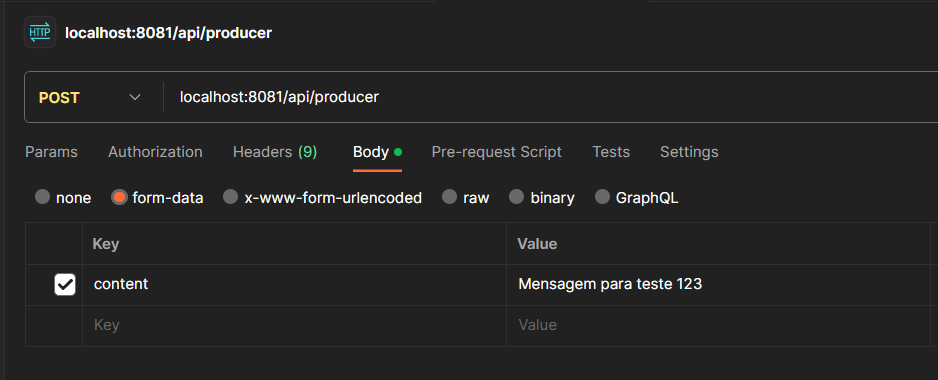
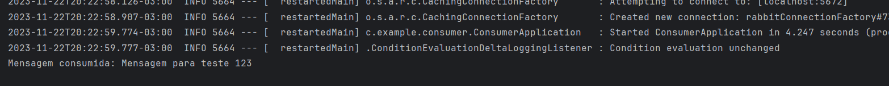
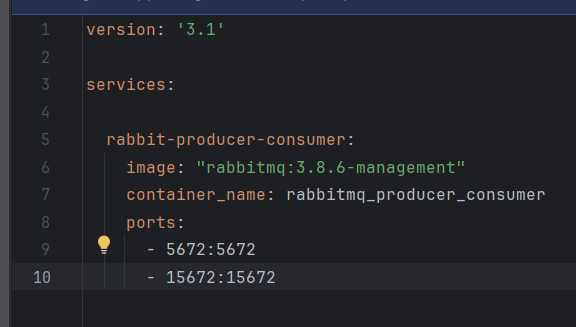
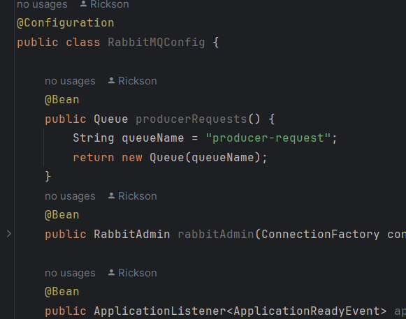
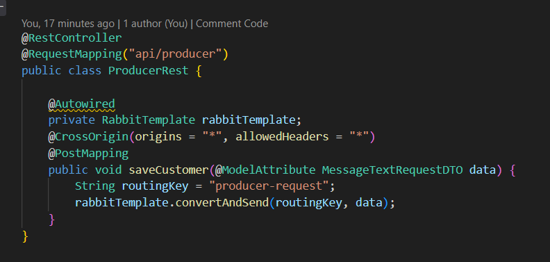
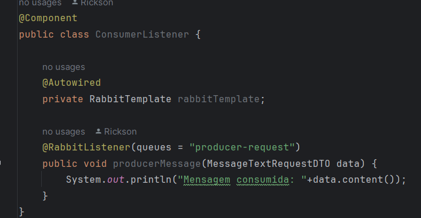

# Produzir e consumir mensagens em filas do Rabbit MQ

## Projeto simples com dois apps em spring boot que usam fila do Rabbit MQ para produzir e consumir mensagens enviadas via http rest.

## Rodar o comando `docker-compose up -d --build` no diretório raiz do app produtor para subir o container do rabbitmq.

### Post da mensagem no app Postman

### Mensagem enviada para o RabbitMQ e consumida pelo app consumer

### Arquivo dockerfile com imagem do Rabbit MQ

### Arquivo de configuração Rabbit MQ

### Escrevendo na fila

### Escutando na fila e print na mensagem

